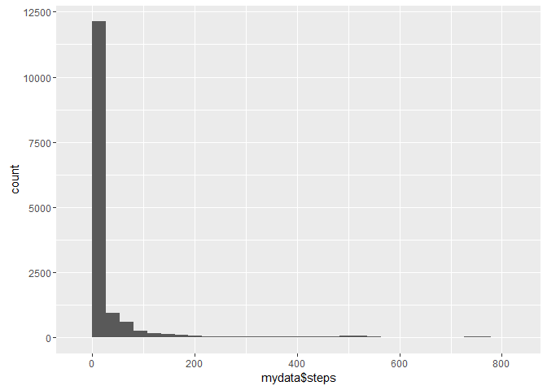

# Reproducible Research: Peer Assessment 1


## Loading and preprocessing the data


```r
getdata <- function () {

  myZip = "./activity.zip"
  csvpath="./temp/activity.csv"
  #unzip the data package into a temp directory
  unzip(myZip, exdir="./temp")

  mydata <- read.csv(csvpath)
  mydata$date <- as.Date(mydata$date)
  
  #head(mydata)
  
  return(mydata)
}

  mydata <- getdata()
  
stepshistogram <- function(mydata){
#   steps.sum <- tapply(mydata$steps, mydata$date, FUN=sum)
#   steps.sum.dataframe <- as.data.frame(steps.sum)
#   hist(steps.sum.dataframe$steps, xlab="Day", ylab="Total steps")
  
   #make a histogram
  library(ggplot2)
  p <- ggplot(data=mydata, aes(mydata$steps)) 
  p <- p + geom_histogram()
  print(p)
  
  #return(steps.sum)
  }
  
stepshistogram(mydata)
```

```
## `stat_bin()` using `bins = 30`. Pick better value with `binwidth`.
```

```
## Warning: Removed 2304 rows containing non-finite values (stat_bin).
```



## What is mean total number of steps taken per day?


```r
get.means.data <- function(mydata){
  means.data <- tapply(mydata$steps, mydata$date, FUN=mean, na.rm=TRUE)
  return(means.data)
}
get.medians.data <- function(mydata) {
  medians.data <- tapply(mydata$steps, mydata$date, median, na.rm=TRUE)
  #sapply(mydata, function(i) tapply(df[[i]], df$group, sd, na.rm=TRUE))
  return(medians.data)
}

means.data <- get.means.data(mydata)
medians.data <- get.medians.data(mydata)
means.medians.matrix <- cbind(means.data, medians.data)

print(means.medians.matrix)
```

```
##            means.data medians.data
## 2012-10-01        NaN           NA
## 2012-10-02  0.4375000            0
## 2012-10-03 39.4166667            0
## 2012-10-04 42.0694444            0
## 2012-10-05 46.1597222            0
## 2012-10-06 53.5416667            0
## 2012-10-07 38.2465278            0
## 2012-10-08        NaN           NA
## 2012-10-09 44.4826389            0
## 2012-10-10 34.3750000            0
## 2012-10-11 35.7777778            0
## 2012-10-12 60.3541667            0
## 2012-10-13 43.1458333            0
## 2012-10-14 52.4236111            0
## 2012-10-15 35.2048611            0
## 2012-10-16 52.3750000            0
## 2012-10-17 46.7083333            0
## 2012-10-18 34.9166667            0
## 2012-10-19 41.0729167            0
## 2012-10-20 36.0937500            0
## 2012-10-21 30.6284722            0
## 2012-10-22 46.7361111            0
## 2012-10-23 30.9652778            0
## 2012-10-24 29.0104167            0
## 2012-10-25  8.6527778            0
## 2012-10-26 23.5347222            0
## 2012-10-27 35.1354167            0
## 2012-10-28 39.7847222            0
## 2012-10-29 17.4236111            0
## 2012-10-30 34.0937500            0
## 2012-10-31 53.5208333            0
## 2012-11-01        NaN           NA
## 2012-11-02 36.8055556            0
## 2012-11-03 36.7048611            0
## 2012-11-04        NaN           NA
## 2012-11-05 36.2465278            0
## 2012-11-06 28.9375000            0
## 2012-11-07 44.7326389            0
## 2012-11-08 11.1770833            0
## 2012-11-09        NaN           NA
## 2012-11-10        NaN           NA
## 2012-11-11 43.7777778            0
## 2012-11-12 37.3784722            0
## 2012-11-13 25.4722222            0
## 2012-11-14        NaN           NA
## 2012-11-15  0.1423611            0
## 2012-11-16 18.8923611            0
## 2012-11-17 49.7881944            0
## 2012-11-18 52.4652778            0
## 2012-11-19 30.6979167            0
## 2012-11-20 15.5277778            0
## 2012-11-21 44.3993056            0
## 2012-11-22 70.9270833            0
## 2012-11-23 73.5902778            0
## 2012-11-24 50.2708333            0
## 2012-11-25 41.0902778            0
## 2012-11-26 38.7569444            0
## 2012-11-27 47.3819444            0
## 2012-11-28 35.3576389            0
## 2012-11-29 24.4687500            0
## 2012-11-30        NaN           NA
```
Provide the summary of this data for comparison against the later question with imputed data.

```r
summary(means.medians.matrix)
```

```
##    means.data       medians.data
##  Min.   : 0.1424   Min.   :0    
##  1st Qu.:30.6979   1st Qu.:0    
##  Median :37.3785   Median :0    
##  Mean   :37.3826   Mean   :0    
##  3rd Qu.:46.1597   3rd Qu.:0    
##  Max.   :73.5903   Max.   :0    
##  NA's   :8         NA's   :8
```

## What is the average daily activity pattern?
What is the average daily activity pattern?

Make a time series plot (i.e. type = "l") of the 5-minute interval (x-axis) and the average number of steps taken, averaged across all days (y-axis)
Which 5-minute interval, on average across all the days in the dataset, contains the maximum number of steps?


```r
plot.daily.activity <- function(mydata) {
  daily.activity.data <- tapply(mydata$steps, mydata$interval, FUN=mean, na.rm=TRUE)
  class(daily.activity.data)
  
  plot(daily.activity.data, type="l", main='Daily Activity', xlab = "Interval", ylab="Average number of steps")
}


plot.daily.activity(mydata)
```


## Imputing missing values
Note that there are a number of days/intervals where there are missing values (coded as NA). The presence of missing days may introduce bias into some calculations or summaries of the data.

Calculate and report the total number of missing values in the dataset (i.e. the total number of rows with NAs)
Devise a strategy for filling in all of the missing values in the dataset. The strategy does not need to be sophisticated. For example, you could use the mean/median for that day, or the mean for that 5-minute interval, etc.
Create a new dataset that is equal to the original dataset but with the missing data filled in.
Make a histogram of the total number of steps taken each day and Calculate and report the mean and median total number of steps taken per day. Do these values differ from the estimates from the first part of the assignment? What is the impact of imputing missing data on the estimates of the total daily number of steps?


```r
impute.activity.data <- function(mydata) {
  # Get a data frame of the average number of steps during each interval, regardless of day

  imputed.activity.data <- mydata
  # debug step
  cat("The unimputed matrix")
  print(head(imputed.activity.data))
  # identify the NA values in the original data and replace with the mean of all steps
  imputed.activity.data$steps[which(is.na(imputed.activity.data$steps))] <- mean(imputed.activity.data$steps, na.rm = TRUE)
  # debug step
  cat("The  matrix with imputed data")
  print(head(imputed.activity.data))

    #make a histogram
  library(ggplot2)
  p <- ggplot(data=imputed.activity.data, aes(imputed.activity.data$steps)) 
  p <- p + geom_histogram()
  print(p)
  
#   means.data <- get.means.data(imputed.activity.data)
#   medians.data <- get.medians.data(imputed.activity.data)
#   imputed.means.medians.matrix <- cbind(means.data, medians.data)
  
  #print(imputed.means.medians.matrix)
  return(imputed.activity.data)
}

imputed.activity.data <- impute.activity.data(mydata)
```

```
## The unimputed matrix  steps       date interval
## 1    NA 2012-10-01        0
## 2    NA 2012-10-01        5
## 3    NA 2012-10-01       10
## 4    NA 2012-10-01       15
## 5    NA 2012-10-01       20
## 6    NA 2012-10-01       25
## The  matrix with imputed data    steps       date interval
## 1 37.3826 2012-10-01        0
## 2 37.3826 2012-10-01        5
## 3 37.3826 2012-10-01       10
## 4 37.3826 2012-10-01       15
## 5 37.3826 2012-10-01       20
## 6 37.3826 2012-10-01       25
```

```
## `stat_bin()` using `bins = 30`. Pick better value with `binwidth`.
```


```r
means.data <- get.means.data(imputed.activity.data)
medians.data <- get.medians.data(imputed.activity.data)
imputed.means.medians.matrix <- cbind(means.data, medians.data)
print(imputed.means.medians.matrix )
```

```
##            means.data medians.data
## 2012-10-01 37.3825996      37.3826
## 2012-10-02  0.4375000       0.0000
## 2012-10-03 39.4166667       0.0000
## 2012-10-04 42.0694444       0.0000
## 2012-10-05 46.1597222       0.0000
## 2012-10-06 53.5416667       0.0000
## 2012-10-07 38.2465278       0.0000
## 2012-10-08 37.3825996      37.3826
## 2012-10-09 44.4826389       0.0000
## 2012-10-10 34.3750000       0.0000
## 2012-10-11 35.7777778       0.0000
## 2012-10-12 60.3541667       0.0000
## 2012-10-13 43.1458333       0.0000
## 2012-10-14 52.4236111       0.0000
## 2012-10-15 35.2048611       0.0000
## 2012-10-16 52.3750000       0.0000
## 2012-10-17 46.7083333       0.0000
## 2012-10-18 34.9166667       0.0000
## 2012-10-19 41.0729167       0.0000
## 2012-10-20 36.0937500       0.0000
## 2012-10-21 30.6284722       0.0000
## 2012-10-22 46.7361111       0.0000
## 2012-10-23 30.9652778       0.0000
## 2012-10-24 29.0104167       0.0000
## 2012-10-25  8.6527778       0.0000
## 2012-10-26 23.5347222       0.0000
## 2012-10-27 35.1354167       0.0000
## 2012-10-28 39.7847222       0.0000
## 2012-10-29 17.4236111       0.0000
## 2012-10-30 34.0937500       0.0000
## 2012-10-31 53.5208333       0.0000
## 2012-11-01 37.3825996      37.3826
## 2012-11-02 36.8055556       0.0000
## 2012-11-03 36.7048611       0.0000
## 2012-11-04 37.3825996      37.3826
## 2012-11-05 36.2465278       0.0000
## 2012-11-06 28.9375000       0.0000
## 2012-11-07 44.7326389       0.0000
## 2012-11-08 11.1770833       0.0000
## 2012-11-09 37.3825996      37.3826
## 2012-11-10 37.3825996      37.3826
## 2012-11-11 43.7777778       0.0000
## 2012-11-12 37.3784722       0.0000
## 2012-11-13 25.4722222       0.0000
## 2012-11-14 37.3825996      37.3826
## 2012-11-15  0.1423611       0.0000
## 2012-11-16 18.8923611       0.0000
## 2012-11-17 49.7881944       0.0000
## 2012-11-18 52.4652778       0.0000
## 2012-11-19 30.6979167       0.0000
## 2012-11-20 15.5277778       0.0000
## 2012-11-21 44.3993056       0.0000
## 2012-11-22 70.9270833       0.0000
## 2012-11-23 73.5902778       0.0000
## 2012-11-24 50.2708333       0.0000
## 2012-11-25 41.0902778       0.0000
## 2012-11-26 38.7569444       0.0000
## 2012-11-27 47.3819444       0.0000
## 2012-11-28 35.3576389       0.0000
## 2012-11-29 24.4687500       0.0000
## 2012-11-30 37.3825996      37.3826
```

The summary of this data for comparison against data with missing values.

```r
summary(imputed.means.medians.matrix)
```

```
##    means.data       medians.data   
##  Min.   : 0.1424   Min.   : 0.000  
##  1st Qu.:34.0938   1st Qu.: 0.000  
##  Median :37.3826   Median : 0.000  
##  Mean   :37.3826   Mean   : 4.903  
##  3rd Qu.:44.4826   3rd Qu.: 0.000  
##  Max.   :73.5903   Max.   :37.383
```


## Are there differences in activity patterns between weekdays and weekends?

This code creates a panel plot containing a time series plot of the 5-minute interval during the day and the average number of steps taken, averaged across all weekday days or weekend days. 


```r
weekend.activity <- function(mydata) {
  # Create a factor with the day of the week
  day <- weekdays(mydata$date) 
  alldays.matrix <- cbind(mydata, day)
  # Replace the day of the week with a weekend or weekday factor
  alldays.matrix$day <- as.character(alldays.matrix$day)
  alldays.matrix$day[alldays.matrix$day == "Monday" |  alldays.matrix$day == "Tuesday" | 
                        alldays.matrix$day == "Wednesday" | alldays.matrix$day == "Thursday"| 
                        alldays.matrix$day == "Friday"] <- "weekday"

  alldays.matrix$day[alldays.matrix$day == "Sunday" | alldays.matrix$day == "Saturday" ] <- "weekend"
  
  weekdays.matrix <- subset(alldays.matrix, day == "weekend")
  weekend.matrix <- subset(alldays.matrix, day == "weekday")
  
  #plot
  weekend.activity.data <- tapply(weekend.matrix$steps, weekend.matrix$interval, FUN=mean, na.rm=TRUE)
  weekday.activity.data <- tapply(weekdays.matrix$steps, weekdays.matrix$interval, FUN=mean, na.rm=TRUE)
  
  par(mfrow=c(2,1))
  plot(weekend.activity.data, type="l", xlab="Interval", ylab="average steps", main="Weekends")
  plot(weekend.activity.data, type="l", xlab="Interval", ylab="average steps", main="Weekdays")
} 

weekend.activity(mydata)
```


